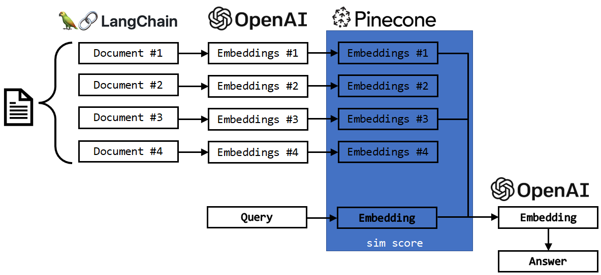
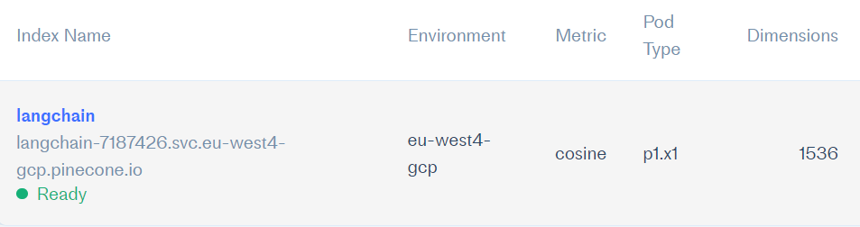

## MAN'S SEARCH FOR MEANING

> The quest for the meaning of life is one of the fundamental strugles of human existence. It's a complex topic that cannot be easily resolved through a single data project. Nonetheless, uncovering meaningful insights can still be informative, even if it doesn't offer a definitive answer to a profound philosophical conundrum.

> The project focuses on a book "[Man's Search for Meaning](https://www.amazon.com/Mans-Search-Meaning-Viktor-Frankl-ebook/dp/B009U9S6FI)" by [Viktor Frankl](https://en.wikipedia.org/wiki/Viktor_Frankl).

## The problem
All LLMs despite being famous for their information retention (derived from their conversational nature) have a specific token limit. When this limit is reached the context of previously obtained data is lost. This prevents large language models from understanding entire books at once and keeping track of information across large portions of text.

## Project outline
To by-pass the issue of token limitation:
1.	A 224-page book was split into 391 parts (using LangChain).
2.	Each part (each text) was transformed into OpenAI vector embeddings and stored in Pinecone database.
3.	A question (query) was provided by the user.
4.	The query was transformed into OpenAI embeddings.
5.	Pinecone calculated a similarity score between the query and each of the book parts.
6.	Only the relevant (most similar) book parts were returned as the output.
7.	This output was then used alongside with the original query by the OpenAI GPT-3.5 model to answer the question stated by the user.

The schema of the outline is presented below alongsite with with some basic database information.
## Project schema

